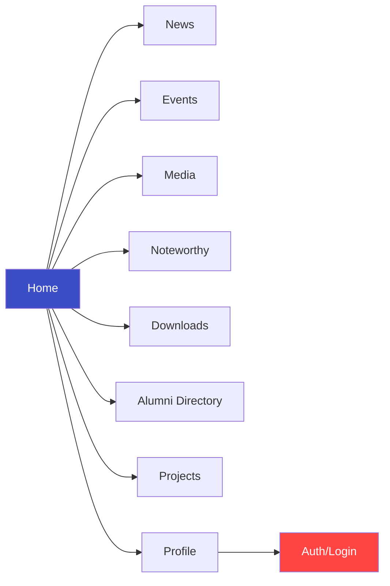

# LDCE Connect — Architecture Document

---

## 1. Architectural Overview

LDCE Connect follows a **Model–View–Controller (MVC)** architecture pattern, adapted for Flutter with the **Provider** state management library. Each feature module is organized into three layers: **Models** (data + API), **Controllers** (business logic + state), and **Views** (UI screens + widgets).

```
┌─────────────────────────────────────────────────────────┐
│                    Flutter Application                  │
├─────────────────────────────────────────────────────────┤
│  ┌─────────┐   ┌─────────────┐   ┌──────────────────┐  │
│  │  Views   │◄──│ Controllers │◄──│     Models       │  │
│  │ (Screens │   │ (ChangeNoti │   │ (Data + API)     │  │
│  │  Widgets)│   │  fier)      │   │                  │  │
│  └────┬─────┘   └──────┬──────┘   └────────┬─────────┘  │
│       │  Consumer/     │ notifyListeners()  │            │
│       │  Provider.of   │                    │            │
│       └────────────────┘                    │            │
│                                             ▼            │
│                                    ┌────────────────┐    │
│                                    │  REST API      │    │
│                                    │  (HTTP Client) │    │
│                                    └────────┬───────┘    │
│                                             │            │
├─────────────────────────────────────────────┼────────────┤
│  Cross-Cutting Concerns                    │            │
│  ┌──────┐ ┌──────┐ ┌──────┐ ┌──────────┐   │            │
│  │Theme │ │i18n  │ │Core  │ │Extensions│   │            │
│  │Engine│ │Layer │ │Utils │ │          │   │            │
│  └──────┘ └──────┘ └──────┘ └──────────┘   │            │
└─────────────────────────────────────────────┼────────────┘
                                              ▼
                                   ┌──────────────────┐
                                   │  Backend API     │
                                   │  (ASP.NET)       │
                                   └──────────────────┘
```

---

## 2. Layer Details

### 2.1 Model Layer (`lib/models/`)

Each model class serves a **dual purpose**:

1. **Data Representation** — Dart class with typed fields and `fromJson`/`toJson` serialization
2. **API Service** — Static methods that handle HTTP requests, response parsing, and data transformation

```
Model Class
├── Fields (typed properties)
├── Constructor
├── fromJson() / fromMap()       → JSON deserialization
├── toJson() / toMap()           → JSON serialization (where needed)
├── getData()                    → HTTP GET request to REST API
├── getListFromJson()            → Parse JSON array → List<Model>
├── getDummyList()               → Fetch paginated list
└── toString()                   → Debug string representation
```

**Key Design Decisions:**
- API calls are embedded directly in model classes (active record pattern)
- All API responses follow a `{ "Status": bool, "Message": string, "Result": data }` wrapper
- Pagination is handled via `pageSize` and `pageNumber` parameters
- Error handling uses try-catch with `TimeoutException`, `SocketException`, and generic `Error`

### 2.2 Controller Layer (`lib/controllers/`)

Controllers are `ChangeNotifier` classes registered as providers. They:

- Hold **UI state** (`showLoading`, `uiLoading`, `exceptionCreated`, `hasMoreData`)
- Invoke **model methods** to fetch data
- Call `notifyListeners()` to trigger UI rebuilds
- Manage **pagination state** for infinite scroll

```
Controller (ChangeNotifier)
├── State Flags (showLoading, uiLoading, exceptionCreated)
├── Data Lists (late List<Model>)
├── Pagination State (hasMoreData, currentPage)
├── UI Controllers (PageController, TextEditingController)
├── fetchData()          → Initial data load
├── loadMore(pageNumber) → Paginated loading
└── getSingle(id)        → Single item fetch
```

### 2.3 View Layer (`lib/views/`)

Views are StatefulWidgets or StatelessWidgets that:

- Access controllers via `Provider.of<T>(context)` or `Consumer<T>`
- Render loading shimmer effects during data fetch
- Display paginated lists with scroll-based load-more
- Navigate between screens via named routes

### 2.4 Cross-Cutting Layers

| Layer | Path | Purpose |
|---|---|---|
| **Core** | `lib/core/` | Global constants (`BASE_API_URL`), internet check, image viewer, secure storage |
| **Theme** | `lib/theme/` | `AppTheme` with light/dark `ThemeData`, `CustomTheme`, navigation theme |
| **Extensions** | `lib/extensions/` | Dart extensions for `String`, `DateTime`, `int`, `double`, `bool`, widgets |
| **Localizations** | `lib/localizations/` | `AppLocalizationsDelegate`, `Language` config, `Translator` |
| **Utils** | `lib/utils/` | Custom badge icons, notification service (backup) |

---

## 3. Feature Module Architecture

Each feature follows a consistent folder structure:

```
feature_name/
├── controllers/feature_name/
│   └── feature_controller.dart      # ChangeNotifier business logic
├── models/feature_name/
│   ├── feature_model.dart           # Data class + API methods
│   └── feature.json                 # Offline fallback data (legacy)
└── views/feature_name/
    ├── feature_home_screen.dart      # List/grid view
    └── single_feature_screen.dart    # Detail view
```

### Module Map



---

## 4. State Management Flow

```
User Action (tap, scroll, pull-to-refresh)
        │
        ▼
  View calls Controller method
        │
        ▼
  Controller calls Model.staticMethod()
        │
        ▼
  Model performs HTTP request → REST API
        │
        ▼
  Model parses JSON → returns List<Model>
        │
        ▼
  Controller stores data, updates state flags
        │
        ▼
  Controller calls notifyListeners()
        │
        ▼
  View rebuilds via Consumer<Controller>
```

---

## 5. Navigation Architecture

The app uses Flutter's **named route** navigation system, configured in `main.dart`:

```
MaterialApp
├── initialRoute: 'home'
├── routes: {
│   'home'                           → HomeScreen (tabbed)
│   'events_home'                    → EventHomeScreen
│   'media_home'                     → MediaHomeScreen
│   'news_home'                      → NewsHomeScreen
│   'noteworthy_home'                → NoteworthyHomeScreen
│   'alumni_directory_home'          → AlumniDirectoryHome
│   'downloads_home'                 → DownloadsHomeScreen
│   'login'                          → LoginScreen
│   'profile'                        → ProfileScreen
│   'single_internet_news_screen'    → SingleInternetNewsScreen
│   'single_internet_events_screen'  → SingleInternetEventScreen
│   'tree_plantation'                → TreePlantationScreen
│   'at_hackathon'                   → ATHackathon
│   'about_us'                       → AboutUsScreen
│   'membership_types'               → MemberShipTypes
│   'something_wrong'                → SomethingWrongScreen
│   }
└── navigatorKey: navKey (GlobalKey for deep linking)
```

**Home Screen** is a tabbed layout with 7 tabs:
1. Home (carousel/slider)
2. News
3. Events
4. Media
5. Noteworthy
6. Projects
7. Downloads

---

## 6. Authentication Flow

```
┌──────────────┐    POST /Login        ┌──────────────┐
│  LoginScreen  │──────────────────────►│  Backend API  │
│  (email +     │    grant_type:        │               │
│   password)   │    password           │               │
└──────┬───────┘                       └──────┬───────┘
       │                                       │
       │                          access_token │
       │◄──────────────────────────────────────┘
       │
       ▼
┌──────────────┐    GET /Alumni/GetId   ┌──────────────┐
│ Secure Store  │──────────────────────►│  Backend API  │
│ (write token) │   Bearer token        │               │
└──────┬───────┘                       └──────┬───────┘
       │                                       │
       │                           encId       │
       │◄──────────────────────────────────────┘
       │
       ▼
┌──────────────┐
│ Secure Store  │
│ (write encId) │
└──────────────┘
```

**Security Implementation:**
- `FlutterSecureStorage` with Android encrypted shared preferences
- OAuth2 password grant flow
- Bearer token authorization header
- Encrypted alumni ID for profile queries

---

## 7. Push Notification Architecture

```
┌────────────────┐         ┌─────────────────────┐
│  Firebase Cloud │────────►│  LDCE Connect App    │
│  Messaging      │         │                     │
└────────────────┘         │  Topics subscribed:  │
                           │  ├── all-android     │
                           │  ├── all-ios          │
                           │  ├── all-dhrumil      │
                           │  └── all (debug)      │
                           │                       │
                           │  Handlers:            │
                           │  ├── Foreground: alert│
                           │  └── Background:      │
                           │       Firebase init    │
                           └───────────────────────┘
```

**Topic Subscriptions:**
- Platform-specific: `all-android`, `all-ios`
- Developer: `all-dhrumil`, `all-dhrumil-dev-11` (debug only)
- Global: `all`, `all-dhrumil-b-sandbox` (debug only)

---

## 8. Theming Architecture

```
AppTheme (static class)
├── themeType: ThemeType.light | ThemeType.dark
├── lightTheme: ThemeData
│   ├── primaryColor: #3C4EC5 (Royal Blue)
│   ├── scaffoldBackgroundColor: #FFFFFF
│   ├── fontFamily: 'Montserrat'
│   └── colorScheme: fromSeed(#3C4EC5)
├── darkTheme: ThemeData
│   ├── primaryColor: #069DEF (Sky Blue)
│   ├── scaffoldBackgroundColor: #161616
│   └── colorScheme: fromSeed(#069DEF)
├── customTheme: CustomTheme (extended colors)
└── AppNotifier: ChangeNotifier (theme state)
```

---

## 9. Error Handling Strategy

| Scenario | Handling |
|---|---|
| Network Timeout | `TimeoutException` catch → print log |
| No Connectivity | `SocketException` catch → Navigate to `NoInternetScreen` |
| SSL Handshake Failure | `HandshakeException` catch → Navigate to `NoInternetScreen` |
| General Errors | `Error` catch → print log, set `exceptionCreated = true` |
| API Error Response | Empty string return → UI shows loading/empty state |
| Internet Check | HTTP GET to `google.com` with 40s timeout |

---

## 10. Data Flow Patterns

### Pagination Pattern (used across News, Events, Media, Alumni, Noteworthy, Downloads)

```dart
// Controller
Future loadMore(int pageNumber) async {
  if (hasMoreData && !globals.isAllXLoaded) {
    data = await Model.getDummyList(pageNumber: pageNumber);
  }
  if (data.length <= 0) {
    hasMoreData = false;
    globals.isAllXLoaded = true;
  }
  notifyListeners();
}
```

### Default Page Sizes

| Module | Default Size |
|---|---|
| News | 5 |
| Events | 5 |
| Media | 5 |
| Noteworthy | 5 |
| Alumni Directory | 25 |
| Digital Downloads | 5 |
| Home Slider | 1 (preview) |

---

## 11. Widget Architecture

The app provides 20+ reusable widgets in `lib/views/widgets/`:

| Widget | Purpose |
|---|---|
| `app_bar_widget` | Consistent app bar across screens |
| `app_drawer_widget` | Navigation drawer |
| `dropdown_widget` | Custom dropdown selectors |
| `expansion_tile_widget` | Expandable content sections |
| `alumni_expansion` | Alumni-specific expandable tile |
| `loading_effect.dart` | Shimmer loading skeletons |
| Various card widgets | Consistent content cards |

---

## 12. Asset Management

```
assets/
├── fonts/
│   ├── CustomBadge.ttf        # Custom icon font
│   └── montserrat.ttf         # Primary body font
├── icons/                     # App launcher icons (6 files)
├── images/
│   ├── banners/               # Promotional banners
│   ├── 75.png                 # LDCE@75 logo (light)
│   └── 75_black.png           # LDCE@75 logo (dark)
└── lang/                      # 5 locale translation files
```
